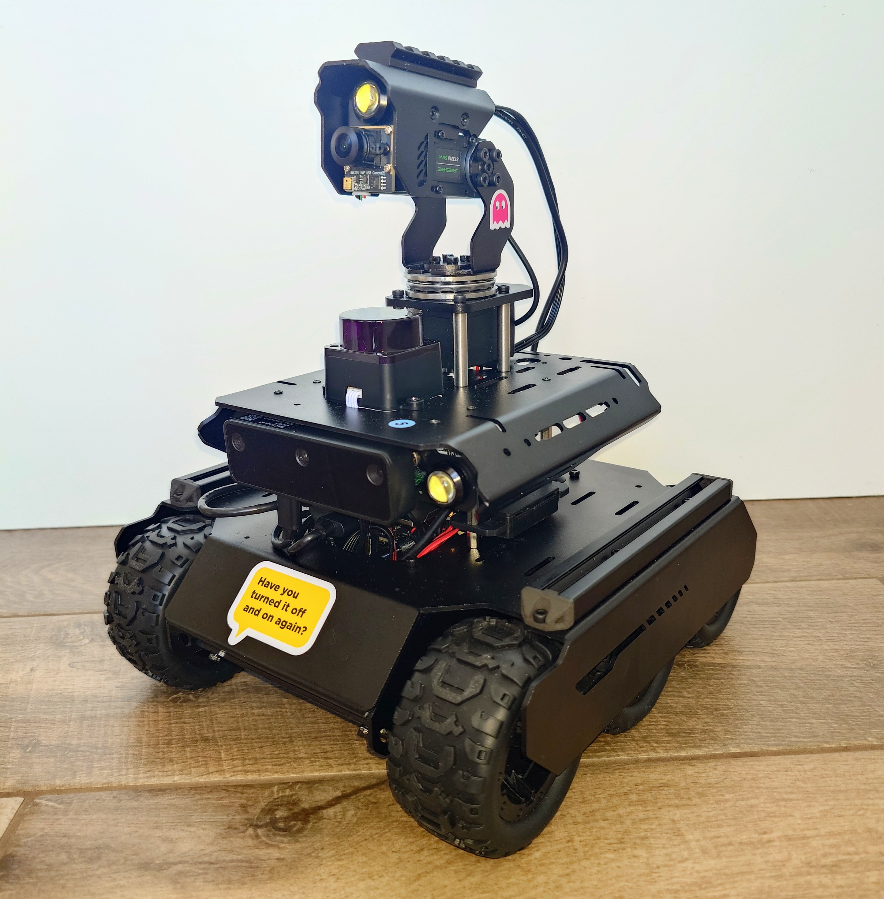

# Progress Updates — knot-losing-you

Progress is logged chronologically here — one entry per meaningful milestone.

---

<!-- Add entries below in the format:

## Entry N: Title
*Date: Month DD, YYYY*

Short description of what was done and why.

**Section Header:**
- Bullet point 1
- Bullet point 2

**Key Achievements:**
- First achievement
- Second achievement

-->

# Phase 2: Sensor Calibration

## Entry 4: LiDAR–Camera Angular Offset Calibration Complete
*Date: March 25, 2026*

Built and verified the angular offset calibration tool — the second step in Phase 2. The LiDAR and pan-tilt camera now share a common angular reference frame, so a bearing measured in the camera frame can be converted to a LiDAR bearing with a single addition.

**What was done:**
- Built `calibrate_angular_offset.py`, a headless HTTP server that streams a live annotated camera feed to a browser while simultaneously driving the LiDAR and UGV pan-tilt
- The camera feed overlays a vertical guide line at `cx` (the optical centre from intrinsic calibration, not the pixel midpoint), so the operator aligns the calibration target to the true optical axis rather than the geometric centre of the frame
- A state machine (WAITING_ALIGNMENT → SCANNING → COMPLETE / FAILED) controls the workflow; the operator confirms alignment via a `/confirm` endpoint, at which point the script accumulates LiDAR returns in the forward arc for a configurable dwell period and computes the angular centroid as the median signed angle to avoid wrap-around artefacts near 0°
- Added `mounting_offset_deg: 270` to the LiDAR config to account for the physical mounting direction — on this chassis the LiDAR's 0° beam faces the left side of the rover, so all bearings must be rotated into the rover forward frame before use
- Wrote reference documentation covering the theory: the angular offset is a restricted special case of the full 6-DOF extrinsic calibration, valid because the LiDAR scans a single horizontal plane and the follower only needs to convert bearings, not project 3D points into pixel coordinates

**Key Achievements:**
- LiDAR-to-pan-tilt angular offset measured at **2.8°** from 414 LiDAR cluster points and stored in `sensor_config.yaml` under the `extrinsic` key
- LiDAR mounting offset correctly characterised and added to config so all downstream code works in the rover forward frame
- Entire calibration workflow runs headlessly on the Pi over a browser, consistent with the intrinsic calibration tooling
- Extrinsic calibration step of Phase 2 complete ✅

Extrinsic calibration of the angular offset between the LiDAR and Waveshare pan tilt camera:

---

## Entry 3: Waveshare RGB Camera Intrinsic Calibration Complete
*Date: March 23, 2026*

Built and verified the full intrinsic calibration pipeline for the Waveshare RGB camera — the first step in Phase 2. The camera can now report where things actually are in the image, correcting for lens distortion and pixel geometry.

**What was done:**
- Built a headless image capture tool that streams a live annotated feed to a laptop browser — no screen needed on the Pi
- Built a calibration tool that processes the captured images and writes the resulting camera parameters directly into the sensor config
- Wrote reference documentation covering the underlying camera geometry

**Key Achievements:**
- Waveshare RGB camera fully characterised — focal lengths, principal point, and distortion coefficients measured and stored in `sensor_config.yaml`
- Entire calibration workflow runs headlessly on the Pi, operated from a laptop browser
- Intrinsic calibration step of Phase 2 complete ✅

Screenshot of the intrinsic camera calibration process:

---

# Phase 0/1: Baseplate Setup and Hardware Integration

## Entry 2: All Three Sensors Verified & End-to-End Smoke Test Passing
*Date: March 21, 2026*

Implemented and verified standalone connection scripts for the OAK-D Lite camera, LDRobot D500 LiDAR, and Waveshare UGV Rover, then wired them together into a single end-to-end smoke test via `run_follower.py`.

**What was done:**
- Each sensor tested independently via a dedicated script before integration
- All three confirmed operational on the Pi: camera streaming at 1080p @ 30fps, LiDAR parsing packets with CRC validation, rover responding to drive commands
- Smoke test (`run_follower.py`) connects all sensors in sequence and confirms all hardware operational in a single command; includes timeouts on sensor wait loops to fail fast with a clear message if a device is unplugged or misconfigured

**Key Achievements:**
- All three sensors independently verified on the Raspberry Pi before integration
- Unified smoke test confirms end-to-end hardware chain: `python run_follower.py`
- Phase 1 — Hardware Integration fully complete ✅

Log from running smoke test to connect to all sensors:

## Entry 1: Hardware Confirmed & Dev Environment Stood Up
*Date: March 20, 2026*

Physically assembled the rover with all three sensors attached. Confirmed all devices are detected by the Raspberry Pi via `lsusb` and stood up the Python dev environment with pre-commit passing cleanly.

**Physical Hardware Setup:**
- Assembled Waveshare UGV rover with OAK-D Lite, LDRobot D500 LiDAR, and HD RGB camera attached
- Confirmed all devices detected on Pi via `lsusb`: OAK-D Lite (Intel Movidius MyriadX), LiDAR (Silicon Labs CP210x), HD RGB camera (Xitech), UGV base controller (QinHeng CH341)
- Identified D500 LiDAR baud rate as 921600; updated `sensor_config.yaml` accordingly

**Key Achievements:**
- All three sensors physically connected and detected by the Pi before writing a single line of sensor code
- Clean pre-commit baseline established — ruff, mypy, and file checks all green

The "Nauti-Bot" in question (yes I am keeping to the nautical theme):

Connecting to the rover via the Waveshare UI and testing functionality:

